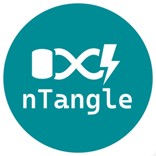

<br/>



<br/>

## Introduction

_nTangle_ is a Change Data Capture (CDC) code generation tool and corresponding runtime. Unlike other CDC-based technologies which replicate changes to rows, _nTangle_ is designed to replicate business entity (aggregate) changes.

For example, if a database contains a `Person` and one-to-many related `Address` table, a traditional CDC replicator would leverage the CDC-capabilities of the database as the data source and replicate all changes from both tables largely distinct from each other. Additional logic would then be required within the downstream systems to aggregate these distinct changes back into a holistic business entity, if possible.

_nTangle_ tackles this differently by packaging the changes at the source into an aggregated entity which is then replicated. With _nTangle_ the CDC-capabilities of the database are leveraged as the trigger, with a corresponding query across all related tables to produce a holistic business entity. Therefore, if a change is made to `Person` or `Address` this will result in the publishing of the entity. Where transactional changes are made to both `Person` and `Address` a single holistic business entity will be published including all changes.

This has a key advantage of being an excellent candidate within event-streaming scenarios where business entities are to be published based on underlying database changes.

<br/>

## Status

[](https://github.com/Avanade/NTangle/actions/workflows/CI.yml) [](https://badge.fury.io/nu/NTangle)

The included [change log](CHANGELOG.md) details all key changes per published version.

<br/>

## Approach

The _nTangle_ CDC approach taken here is to consolidate the tracking of individual tables (one or more) into a aggregated _entity_ to simplify the publishing to an event stream (or equivalent). The advantage of this is where a change occurs to any of the rows related to an entity, even where multiples rows are updated, this will only result in a single event. This makes it easier (more logical) for downstream subscribers to consume.

This is achieved by defining (configuring) the entity, being the primary (parent) table, and its related secondary (child) tables. For example, a `SalesOrder`, may be made up multiple tables - when any of these change then a single `SalesOrder` event should occur. These relationships are also defined with a cardinality of either `OneToMany` or `OneToOne`.

```
SalesOrder             // Parent
└── SalesOrderAddress  // Child 1:n - One or more addresses (e.g. Billing and Shipping)
└── SalesOrderItem     // Child 1:n - One or more items
``` 

The CDC capability is used specifically as a trigger for change (being `Create`, `Update` or `Delete`). The resulting data that is published is the latest, not a snapshot in time (CDC captured). The reason for this is two-fold:
1. Given how the CDC data is batch retrieved there is no guarantee that the CDC captured data represents a final intended state suitable for publishing; and,
1. This process is intended to be running near real-time so getting the latest version will produce the most current committed version as at that time.

To further guarantee only a single event for a specific version is published the resulting _entity_ is JSON serialized and hashed; this value is checked (and saved) against the prior version to ensure a publish contains data that is actionable. This will minimize redundant publishing, whilst also making the underlying processing more efficient.

<br/>

## Change-data-capture (CDC)

This official [documentation](https://docs.microsoft.com/en-us/sql/relational-databases/track-changes/about-change-data-capture-sql-server) describes the Microsoft SQL Server CDC-capabilities.

Although throughout references are made to [Microsoft SQL Server](./docs/SqlServer.md), the intention of _nTangle_ is that it is largely agnostic to the database technology, and therefore support for other databases will (or may) be supported in the future based on demand.

<br/>

## Capabilities

_nTangle_ has been created to provide a seamless means to create CDC-enabled aggregated entity publishing solution. The _nTangle_ solution is composed of the following:

1. [Code generation](#Code-generation) - a configuration file defines the database tables, none or more relationships, and other functionality-based properties, that are used to drive the database-driven code-generation to create the required solution artefacts.
2. [Runtime](#Runtime) - the generated solution artefacts leverage a number of .NET runtime components/capabilities to support and enable. The code-generated solution then uses these at runtime to execute and orchestrate the CDC-triggered aggregated entity publishing process. 

<br/>

### Code-generation

The code-generation is managed via a console application using the [`CodeGenConsole`](./src/NTangle/Console/CodeGenConsole.cs) to manage. This internally leverages [OnRamp](https://github.com/Avanade/onramp) to enable. 

Additionally, the code-generator inspects (queries) the database to infer the underlying table schema for all tables and their columns. This is used as a source in which the configuration references to validate, whilst also minimizes configuration where the inferred schema information can be used. The code-generation adopts a gen-many philosophy, therefore where schema changes are made, the code-generation can be executed again to update accordingly.

As stated, the code-generation is driven by a configuration file, typically named `ntangle.yaml`. Both YAML and JSON formats are supported; there is also a corresponding [JSON schema](./schemas/ntangle.json) to enable editor intellisense, etc.

The _nTangle_ configuration is as follows:

```
Root
└── Table(s)
  └── Join(s)
    └── JoinOn(s)
    └── JoinMapping(s)
  └── TableMapping(s)
```

Documentation related to each of the above are as follows:
- [`Root`](./docs/generated/root.md) - defines the root configuration settings.
- [`Table`](./docs/generated/table.md) - defines the primary table as being the entity aggregate.
- [`Join`](./docs/generated/join.md) - defines none or more table joins to include within the entity.
- [`JoinOn`](./docs/generated/joinon.md) - defines the join on column characteristics.
- [`JoinMapping`](./docs/generated/joinmapping.md) - defines global identifier mappings for any of the join table columns.
- [`TableMapping`](./docs/generated/tablemapping.md) - defines global identifier mappings for any of the primary table columns.

An example [ntangle.yaml](./samples/SqlServerDemo/SqlServerDemo.CodeGen/ntangle.yaml) configuration file exists within the [`SqlServerDemo`](./samples/SqlServerDemo) sample. The [`SqlServerDemo.CodeGen`](./samples/SqlServerDemo/SqlServerDemo.CodeGen) sample also demonstrates how to invoke the code generator from the underlying [`Program`](./samples/SqlServerDemo/SqlServerDemo.CodeGen/Program.cs).

The code-generator will output a number of generated artefacts ; these will be either database-related (see [`SqlServerDemo.Database`](./samples/SqlServerDemo/SqlServerDemo.Database) sample) or corresponding .NET runtime components (see [`SqlServerDemo.Publisher`](./samples/SqlServerDemo/SqlServerDemo.Publisher) sample).


The following [`NTangle`](./src/NTangle) namespaces provide code-generation capabilties:

Namespace | Description
-|-
[`Config`](./src/NTangle/Config) | The _internal_ capabilities that support the YAML/JSON configuration.
[`Console`](./src/NTangle/Console) | The code-generation tooling capabilities, primarily [`CodeGenConsole`](./src/NTangle/Console/CodeGenConsole.cs).
[`Generators`](./src/NTangle/Generators) | The _internal_ code-generators used to select configuration for one or more [`Templates`](./src/NTangle/Templates) as orchestrated by the underlying [`Scripts`](./src/NTangle/Scripts).

<br/>

### Runtime

Generally, a runtime publisher is required to orchestrate the CDC-triggered aggregated entity publishing process (see [`SqlServerDemo.Publisher`](./samples/SqlServerDemo/SqlServerDemo.Publisher) sample). This in turn takes a dependency on the _nTangle_ runtime to enable.

The following [`NTangle`](./src/NTangle) namespaces provide runtime capabilties:

Namespace | Description
-|-
[`Cdc`](./src/NTangle/Cdc) | CDC-orchestration capabilities, primarily [`EntityOrchestrator`](./src/NTangle/Cdc/EntityOrchestrator.cs).
[`Data`](./src/NTangle/Data) | Database access capabilities to support the likes of batch tracking, identifier mapping, outbox and versioning.
[`Events`](./src/NTangle/Events) | Event capabilities, primarily [`IEventPublisher`](./src/NTangle/Events/IEventPublisher.cs) and [`CloudEventSerializer`](./src/NTangle/Events/CloudEventSerializer.cs).
[`Services`](./src/NTangle/Services) | Service hosting capabilities, primarily [`HostedService`](./src/NTangle/Services/HostedServiceT.cs) and [`OutboxService`](./src/NTangle/Services/OutboxDequeueHostedService.cs).
[`Utility`](./src/NTangle/Utility) | Additional utility-style capabilities used internally.

<br/>

## Additional documentation

The following are references to additional documentation.

- [Microsoft SQL Server](./docs/SqlServer.md) - deep-dive of Microsoft SQL Server implementation.

<br/>

## Samples

The following samples are provided to guide usage:

Sample | Description
-|-
[`SqlServerDemo`](./samples/SqlServerDemo) | A sample as an end-to-end solution walkthrough to demonstrate the usage of _nTangle_ against a Microsoft SQL Server database.

<br/>

## Tooling

The following tools are provided to support development:

Sample | Description
-|-
[`NTangle.Template`](./tools/NTangle.Template) | This is the .NET template used to accelerate the creation of an _nTangle_ solution and all projects using `dotnet new`. This leverages the .NET Core [templating](https://docs.microsoft.com/en-au/dotnet/core/tools/custom-templates) functionality.
[`NTangle.ArtefactGenerate.Tool`](./tools/NTangle.ArtefactGenerate.Tool) | This in an _internal_ tool used for _nTangle_ development that provides a means to auto-generate the corresponding JSON Schema and markdown documentation from the related .NET configuration entities.

<br/>

## License

_OnRamp_ is open source under the [MIT license](./LICENSE) and is free for commercial use.

<br/>

## Contributing

One of the easiest ways to contribute is to participate in discussions on GitHub issues. You can also contribute by submitting pull requests (PR) with code changes. Contributions are welcome. See information on [contributing](./CONTRIBUTING.md), as well as our [code of conduct](https://avanade.github.io/code-of-conduct/).

<br/>

## Security

See our [security disclosure](./SECURITY.md) policy.

<br/>

## Who is Avanade?

[Avanade](https://www.avanade.com) is the leading provider of innovative digital and cloud services, business solutions and design-led experiences on the Microsoft ecosystem, and the power behind the Accenture Microsoft Business Group.
