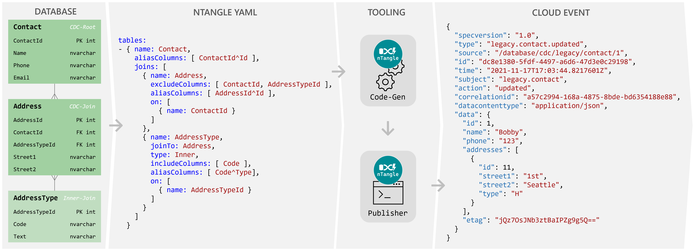
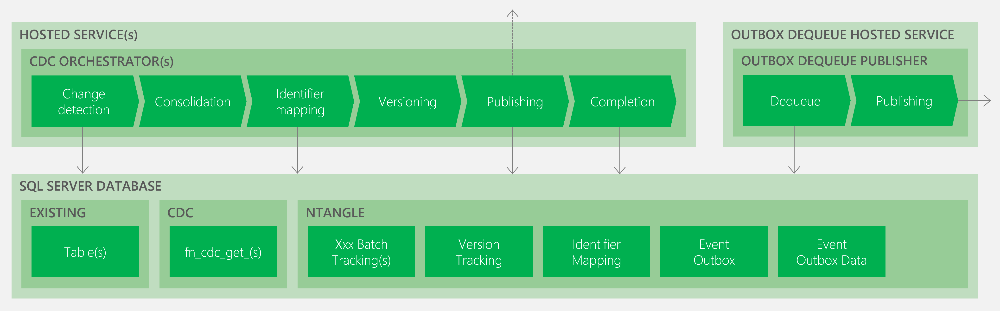

# Microsoft SQL Server

This documents the _nTangle_ [architecture](#Architecture) and corresponding [code-generation](#Code-generation) when targeting a Microsoft SQL Server database. 

 

## Overview

At its core _nTangle_ is a database-driven code-generation solution, in that it leverages an existing database to infer its underlying schema (tables and columns). A YAML (or JSON) configuration file is required to define the CDC requirements, being the root and child tables, and their relationships, representing the entity (aggregate root). The _nTangle_ code-gen tool connects to the database, and using the YAML configuration generates the required database (main and sidecar), and .NET publishing runtime artefacts. This publishing runtime then uses the database's CDC capabilities to detect changes to the underlying tables and trigger the creation of the related entity events that are then published.

The core components are:
- **Database** - the existing tables (main database), plus generated _nTangle_ runtime artefacts (including outbox) in separate sidecar database;
- **Config** - the _nTangle_ code-gen configuration;
- **Tooling** - the _nTangle_ code generator and resulting generated publisher .NET runtime;
- **Events** - the resulting published entity event (depicted as a [CloudEvent](https://cloudevents.io/)).

 

## Change-data-capture (CDC)

This official [documentation](https://docs.microsoft.com/en-us/sql/relational-databases/track-changes/about-change-data-capture-sql-server) describes the Microsoft SQL Server CDC-capabilities.

In addition, this [article](https://www.mssqltips.com/sqlservertip/5212/sql-server-temporal-tables-vs-change-data-capture-vs-change-tracking--part-2/) provides an excellent overview of the Microsoft SQL Server CDC-capabilities and walks through the process of setting up and using to aid in the fundamental understanding of this _key_ dependent capability.

 

### Performance considerations

The introduction of CDC into a database may have an impact on the database performance, and as such it is important to consider this impact; see [performance considerations](https://learn.microsoft.com/en-us/sql/relational-databases/track-changes/about-change-data-capture-sql-server?view=sql-server-ver16#performance-considerations).

Within the _nTangle_ configuration the `CdcEnable` property can be used to enable/disable the automatic generation of the CDC-related `sys.sp_cdc_enable_table` TSQL code. This allows the developer and/or database administrator to manually enable CDC on the required tables external to _nTangle_ code generation. By default, the `CdcEnable` property is set to `false`.

Given the above, it is generally _recommended_ that CDC enablement is explicity managed by the developer and/or database administrator. Additionally, as schema changes are made to the underlying tables the CDC configuration may need to be changed accordingly; this does not happen automatically within SQL Server; see this article for more [information](https://www.mssqltips.com/sqlservertip/4096/understanding-how-dml-and-ddl-changes-impact-change-data-capture-in-sql-server/).

 

### CDC vs Change Tracking

Microsoft SQL Server provides two change tracking capabilities, namely CDC and [Change Tracking](https://learn.microsoft.com/en-us/sql/relational-databases/track-changes/track-data-changes-sql-server#Tracking). Change Tracking differs in that it _only_ captures the fact that rows in a table were changed, but doesn't capture the data that was changed. Given the multiple related table hierarchy triggering that _nTangle_ enables the joining columns as well as the primary key columns are required to be captured; this is not possible with Change Tracking as it only captures the primary key columns; therefore, making it unsuitable for walking back up the join hierarchy to determine the primary entity (aggregate root) that was changed. And largely impossible where a child table row has been physically deleted.

 

## Sidecar database

As of version `3.0.0` the preferred (recommended and default) approach is to use a sidecar database to manage the _nTangle_ runtime artefacts. This is to ensure that the main database is not polluted with the _nTangle_ specific artefacts, and to ensure that the _nTangle_ runtime can be easily removed without impacting the main database as required.

Primarily, usage of a sidecar database will also limit impact (load and data) on the main database by minimizing access to the CDC and related entity data selection only. Otherwise, the required orchestration will occur against the sidecar database.

Note that there are _no_ cross database dependencies; as such, the sidecar database can be hosted separately, be on a different version, etc. as required. The .NET orchestrator logic _will_ however require access to both databases to function.

 

## Architecture

The following represents the high-level conceptual run-time architecture for a solution leveraging _nTangle_.

 

The SQL Server databases are as follows:
- **Main** - the existing database schema (tables and columns) that is being monitored for changes (CDC).
- **Sidecar** - the generated _nTangle_ runtime artefacts (tables and stored procedures) that are used to orchestrate the CDC and event publishing.

The key .NET components are as follows.
- [**Orchestrator**](#Orchestrator) - one per entity (aggregate root) change tracking and event publisher orchestrator (execution phases depicted).
- [**Hosted service**](#Hosted-service) - one per entity (aggregate root) timer-based hosted service responsible for executing the orchestrator (optional).
- [**Outbox dequeue publisher**](#Outbox-dequeue-publisher) - event outbox dequeue and publishing (execution phases depicted).
- [**Outbox dequeue hosted service**](#Outbox-dequeue-hosted-service) - timer-based hosted service responsible for executing the outbox dequeue publisher.

 

### Orchestrator

The [`XxxOrchestrator`](../samples/SqlServerSidecarDemo/SqlServerSidecarDemo.Publisher/Data/Generated/ContactOrchestrator.cs) is responsible for the primary orchestration of the CDC-related change tracking and event publishing - this is essentially the "secret sauce" behind _nTangle_. This is achieved by executing (orchestrating) the following phases in the order specifed.

- [Change detection](#Change-detection) - detects changes to the underlying tables and packages within a batch;
- [Consolidation](#Consolidation) - consolidate changes to minimize redundant event publishing and upsert batch configuration;
- [Identifier mapping](#Identifier-mapping) - assign global identifier mappings (where applicable);
- [Versioning](#Versioning) - version events to minimize publishing with same content;
- [Publishing](#Publishing) - publish / send unique events to selected destination;
- [Completion](#Completion) - complete batch and record latest version hashes.

The [`XxxOrchestrator`](../samples/SqlServerSidecarDemo/SqlServerSidecarDemo.Publisher/Data/Generated/ContactOrchestrator.cs) inherits from
 [`EntitySidecarOrchestrator`](../src/NTangle/Cdc/EntitySidecarOrchestrator.cs), which in turn inherits from [`EntitySidecarOrchestratorBase`](../src/NTangle/Cdc/EntitySidecarOrchestratorBase.cs) and [`EntityOrchestratorCore`](../src/NTangle/Cdc/EntityOrchestratorCore.cs), to enable the standardized orchestration processing.

An orchestrator is generated per [entity](../src/NTangle/IEntity.cs) (the aggregate root which has a naming convention of [`XxxCdc`](../samples/SqlServerSidecarDemo/SqlServerSidecarDemo.Publisher/Entities/Generated/ContactCdc.cs)). The entity is essentially the .NET representation of the configured root and child table hierarchy, and selected columns as properties.

 

#### Change detection

A batch check is performed against the sidecar database using the [`spXxxBatchExecute`](../samples/SqlServerSidecarDemo/SqlServerSidecarDemo.SidecarDb/Schema/NTangle/Stored%20Procedures/Generated/spContactBatchExecute.sql) stored procedure to determine if there is already an incomplete Batch and attempt to reprocess; otherwise, determine current CDC position from last complete Batch to continue. The batch tracking is persisted in the [`XxxBatchTracking`](../samples/SqlServerSidecarDemo/SqlServerSidecarDemo.SidecarDb/Migrations/20241024-233018-03-create-ntangle-contactbatchtracking-table.sql) table.

The orchestrator will the select (detect) the changes as enabled by the SQL Server CDC capabilities in the main database. This is achieved by invoking the [`XxxExecuteBatch`](../samples/SqlServerSidecarDemo/SqlServerSidecarDemo.Publisher/Resources/Generated/ContactExecuteBatch.sql) SQL statement and updating the corresponding result sets into the .NET entity equivalents. The following steps are performed.

Step | Description
-|-
LSN check | Get minimum and maximum LSNs for each table. If the minimum is less than previous Batch minimum then there is a CDC data loss scenario and some changes will be lost as a result; this will error unless option to continue with data loss is selected.
Root CDC | Gets all CDC changes (create, update and delete) for the table (see [`fn_cdc_get_all_changes_`](https://docs.microsoft.com/en-us/sql/relational-databases/system-functions/cdc-fn-cdc-get-all-changes-capture-instance-transact-sql)) up to the maximum query size, and stores the result into a temporary `#changes` table.
Child CDC | Gets all CDC changes (create, update and delete) for each child table up to the maximum query size joining against the parent table(s) to ensure existence. Appends the result into the temporary `#changes` table where distinct (as per root table primary key).
Batch select | Select the resulting batch LSN data so that can be persisted within the sidecar database by the orchestrator.
Root query | Select result set using the temporary `#changes` table to left outer join to the root table (latest).
Child query | Select result set using the temporary `#changes` for each child table using inner joins to ensure data is selected for only what currently exists within the database (latest).

 

#### Consolidation

The orchestrator will consolidate the selected data returned from the [change detection](#Change-detection) phase. The following consolidations are performed for each distinct _primary key_ from the root table (being the aggregated entity), in order specified. The result of the consolidation phase is that there should be zero or more records (one per _primary key_ from the root table).

Step | Description
-|-
Delete wins | Where there is a create and/or, one or more updates, followed by a delete, then only the delete will be considered for publishing. Can not include intermediary create/update events as the data is no longer available (physically deleted).
Create wins | Where there is a create, followed by one or more updates, then only the create will be considered for publishing.

Where a delete is referenced above, this relates to both physical and logical deletes equally (as per configuration).

Once consolidated the orchestrator will manage the batch tracking, either update (where previous was incomplete) or insert (where new) the batch data into the [XxxBatchTracking](../samples/SqlServerSidecarDemo/SqlServerSidecarDemo.SidecarDb/Migrations/20241024-233018-03-create-ntangle-contactbatchtracking-table.sql) using the [`spXxxBatchTracking`](../samples/SqlServerSidecarDemo/SqlServerSidecarDemo.SidecarDb/Schema/NTangle/Stored%20Procedures/Generated/spContactBatchTracking.sql) stored procedure. This stored procedure will also query for the latest version hash and identifier mapping (where configured) data for entities in the batch; as needed by the following phases.

 

#### Identifier mapping

The orhestrator (where identifier mapping is configured) will assign new global identifiers generated using [`IIdentifierGenerator<T>`](https://github.com/Avanade/CoreEx/blob/main/src/CoreEx/Entities/IIdentifierGenerator.cs) to each of the selected columns where no value was previously selected during the [consolidation](#Consolidation) phase.

The [`spIdentifierMappingCreate`](../samples/SqlServerSidecarDemo/SqlServerSidecarDemo.SidecarDb/Schema/NTangle/Stored%20Procedures/Generated/spIdentifierMappingCreate.sql) stored procedure is then invoked to persist any new mappings into the [`IdentifierMapping`](../samples/SqlServerSidecarDemo/SqlServerSidecarDemo.SidecarDb/Migrations/20241024-233018-07-create-ntangle-identifiermapping-table.sql) table; where mappings are already assigned, then the previously assigned value will be returned for use and the newly allocated value discarded. This may occur where concurrent access is being performed against the same related identifier.

 

#### Versioning

The orchestrator will version each record by JSON serializing the data (removing any properties that should be excluded) and then [SHA256](https://docs.microsoft.com/en-us/dotnet/api/system.security.cryptography.sha256) hashed. This is compared to the existing version (from the [`VersionTracking`](../samples/SqlServerSidecarDemo/SqlServerSidecarDemo.SidecarDb/Migrations/20241024-233018-02-create-ntangle-versiontracking-table.sql) table) selected during the [consolidation](#Consolidation) phase. Where the version has not changed for the entity then no publish will occur; avoids sending same event content more than once.

 

#### Publishing

The orchestrator will instantiate an [`EventData`](https://github.com/Avanade/CoreEx/blob/main/src/CoreEx/Events/EventData.cs) per record, then invoke the [`IEventPublisher.Publish()`](https://github.com/Avanade/CoreEx/blob/main/src/CoreEx/Events/IEventPublisher.cs) passing all events to be published.

The default is to use the generated [`EventOutboxEnqueue`](../samples/SqlServerSidecarDemo/SqlServerSidecarDemo.Publisher/Data/Generated/EventOutboxEnqueue.cs) which enqueues all events using stored procedure [`spEventOutboxEnqueue`](../samples/SqlServerSidecarDemo/SqlServerSidecarDemo.SidecarDb/Schema/Outbox/Stored%20Procedures/Generated/spEventOutboxEnqueue.sql) into the [`EventOutbox`](../samples/SqlServerSidecarDemo/SqlServerSidecarDemo.SidecarDb/Migrations/20241024-233018-05-create-outbox-eventoutbox-table.sql) and [`EventOutboxData`](../samples/SqlServerSidecarDemo/SqlServerSidecarDemo.SidecarDb/Migrations/20241024-233018-06-create-outbox-eventoutboxdata-table.sql) tables. This can be configured to use an alternate `IEventPublisher` where required.

There are multiple advantages of using the event outbox, a) a log of published events will be maintained, b) performance of orchestrator may be improved, c) dependency of external destination removed from orchestrator, and d) multiple sends will have the same event identifier which is useful in duplicate detection scenarios guaranteeing at least once delivery.

 

#### Completion

The orchestrator will complete the batch and update the latest version tracking hashes. This phase is managed by the [`spXxxBatchComplete`](../samples/SqlServerSidecarDemo/SqlServerSidecarDemo.SidecarDb/Schema/NTangle/Stored%20Procedures/Generated/spContactBatchComplete.sql) stored procedure. The following stored procedure steps are all performed within a database transactional context.

Step | Description
-|-
Batch complete | Update the batch as complete within the [XxxBatchTracking](../samples/SqlServerSidecarDemo/SqlServerSidecarDemo.SidecarDb/Migrations/20241024-233018-03-create-ntangle-contactbatchtracking-table.sql) table, including updating the completed date/time.
Version tracking | Create or update (merge) the latest versions for each of the records published into the [`VersionTracking`](../samples/SqlServerSidecarDemo/SqlServerSidecarDemo.SidecarDb/Migrations/20241024-233018-02-create-ntangle-versiontracking-table.sql) table.

 

### Hosted service

The [`XxxHostedService`](../samples/SqlServerSidecarDemo/SqlServerSidecarDemo.Publisher/Services/Generated/ContactHostedService.cs) is responsible for hosting the [Orchestrator](#Orchestrator) at runtime. This is a [synchronized timer-based hosted service](https://github.com/Avanade/CoreEx/blob/main/src/CoreEx/Hosting/SynchronizedTimerHostedServiceBase.cs) which will continue to execute on a configured interval until the process host is stopped.

An [`IServiceSynchronizer`](https://github.com/Avanade/CoreEx/blob/main/src/CoreEx/Hosting/IServiceSynchronizer.cs) is required by the `XxxHostedService` to ensure that _only_ a single serivce per root table is running at any given time. This is primarily needed to ensure that the explicit order of changes in honored; otherwise, events for the root table would be emitted out of sequence (and/or duplicated).

The `XxxHostedService` is not explicitly required and can be replaced with any other host implementation, i.e. timer-based trigger Azure Function that directly invokes the `XxxOrchestrator`. As above, this host will need to manage the sychronized singleton behavior; see [`BlobLeaseSynchronizer`](https://github.com/Avanade/CoreEx/blob/main/src/CoreEx.Azure/Storage/BlobLeaseSynchronizer.cs).

 

### Outbox dequeue publisher

The [`EventOutboxHostedService`](https://github.com/Avanade/CoreEx/blob/main/src/CoreEx.Database.SqlServer/Outbox/EventOutboxHostedService.cs) is responsible for managing the dequeue of events from the database and then sending. This is achieved by executing the following phases in the order specifed.

- [Dequeue](#Dequeue) - dequeue one or more events from the outbox;
- [Sending](#sending) - send events to selected destination.

The phases are encapsulated within a database transaction to ensure that the publishing completes successfully before the dequeue is committed. As a result this will ensure guaranteed delivery, but may result in messages being sent more than once. The event receiver may be required to perform duplicate detection on the events where duplicates can not be tolerated.

The [`EventOutboxHostedService`](https://github.com/Avanade/CoreEx/blob/main/src/CoreEx.Database.SqlServer/Outbox/EventOutboxHostedService.cs) property `EventOutboxDequeueFactory` must be set to instantiate an instance of the [`EventOutboxDequeueBase`](https://github.com/Avanade/CoreEx/blob/main/src/CoreEx.Database.SqlServer/Outbox/EventOutboxDequeueBase.cs), being the generated [`EventOutboxDequeue`](../samples/SqlServerSidecarDemo/SqlServerSidecarDemo.Publisher/Data/Generated/EventOutboxDequeue.cs). This manages the final [`IEventSender`](https://github.com/Avanade/CoreEx/blob/main/src/CoreEx/Events/IEventSender.cs) to send the events to the final destination.

 

#### Dequeue

The events will be dequeued (up to the maximum dequeue size) from the database using stored procedure [`spEventOutboxDequeue`](../samples/SqlServerSidecarDemo/SqlServerSidecarDemo.SidecarDb/Schema/Outbox/Stored%20Procedures/Generated/spEventOutboxDequeue.sql); this will dequeue the events from the underlying [`EventOutbox`](../samples/SqlServerSidecarDemo/SqlServerSidecarDemo.SidecarDb/Migrations/20241024-233018-05-create-outbox-eventoutbox-table.sql) and [`EventOutboxData`](../samples/SqlServerSidecarDemo/SqlServerSidecarDemo.SidecarDb/Migrations/20241024-233018-06-create-outbox-eventoutboxdata-table.sql) tables.

 

#### Sending

The [`EventOutboxDequeue`](../samples/SqlServerSidecarDemo/SqlServerSidecarDemo.Publisher/Data/Generated/EventOutboxDequeue.cs) manages the final [`IEventSender`](https://github.com/Avanade/CoreEx/blob/main/src/CoreEx/Events/IEventSender.cs) to send the events to the final destination.

To leverage the likes of Azure Service Bus consider the _CoreEx_ [`ServiceBusSender`](https://github.com/Avanade/CoreEx/blob/main/src/CoreEx.Azure/ServiceBus/ServiceBusSender.cs).

 

### Outbox dequeue hosted service

The [`EventOutboxHostedService`](https://github.com/Avanade/CoreEx/blob/main/src/CoreEx.Database.SqlServer/Outbox/EventOutboxHostedService.cs) is responsible for hosting the [Outbox dequeue publisher](#Outbox-dequeue-publisher) at runtime. This is a [synchronized timer-based service](https://github.com/Avanade/CoreEx/blob/main/src/CoreEx/Hosting/SynchronizedTimerHostedServiceBase.cs) which will continue to execute on a configured interval until the process host is stopped.

 

### Explicit execution

In addition to the primary sidecar behavior, the [`XxxOrchestrator`](../samples/SqlServerSidecarDemo/SqlServerSidecarDemo.Publisher/Data/Generated/ContactOrchestrator.cs) can be explicitly executed (`ExecuteExplicitAsync`) for a specified set of primary keys bypassing CDC and batch tracking. 

This is useful for scenarios:
a) Where a specific set of records need to be reprocessed or where the CDC data has been lost;
b) As a one-off operation to perform an initial load of data to be published;
c) Alternate triggering where _nTangle_ CDC is not permissable (i.e. using Debezium, etc) to get the best of both worlds, being an external trigger and leveraging the entity-based publishing.

The hosting of the `XxxOrchestrator` to enable explicit execution is the responsibility of the developer; i.e. nothing is generated to support. 

 

## Code-generation

The [code-generator](../tools/NTangle.Template/content/AppName.CodeGen/Program.cs) will leverage the [ntangle.yaml](../tools/NTangle.Template/content/AppName.CodeGen/ntangle.yaml) configuration to generate the [Main database](#Main-database), [Sidecar database](#Sidecar-database), and [.NET](#net) artefacts.

Where `Xxx` is referenced in the artefact name this is replaced with the name of the entity (root aggregate). Also, the artefact name represents the default, there are opportunities within the `ntangle.yaml` to change the behavior of these where applicable.

Finally, features such as _event outbox_ and _identity mapping_ are configurable; where not leveraged their respective artefacts will not be generated. 

 

### Main database

The `AppName.Database` project generated artefacts are as follows.

Type | Artefact | Description
-|-|-
Script | [`CdcEnable`](../samples/SqlServerSidecarDemo/SqlServerSidecarDemo.Database/Migrations/CdcEnable.post.deploy.sql) | Turns CDC on for the selected tables (where configured).

 

### Sidecar database

The `AppName.SidecarDb` project generated artefacts are as follows.

Type | Artefact | Description
-|-|-
Schema | [`NTangle`](../samples/SqlServerSidecarDemo/SqlServerSidecarDemo.SidecarDb/Migrations/20241024-233018-01-create-ntangle-schema.sql) | Creates the database schema.
Stored procedure | [`spXxxBatchComplete`](../samples/SqlServerSidecarDemo/SqlServerSidecarDemo.SidecarDb/Schema/NTangle/Stored%20Procedures/Generated/spContactBatchComplete.sql) | Performs the batch completion (per entity).
Stored procedure | [`spXxxBatchExecute`](../samples/SqlServerSidecarDemo/SqlServerSidecarDemo.SidecarDb/Schema/NTangle/Stored%20Procedures/Generated/spContactBatchExecute.sql) | Performs the batch execution (per entity).
Stored procedure | [`spXxxBatchReset`](../samples/SqlServerSidecarDemo/SqlServerSidecarDemo.SidecarDb/Schema/NTangle/Stored%20Procedures/Generated/spContactBatchReset.sql) | Performs the batch LSN reset (per entity).
Stored procedure | [`spXxxBatchTracking`](../samples/SqlServerSidecarDemo/SqlServerSidecarDemo.SidecarDb/Schema/NTangle/Stored%20Procedures/Generated/spContactBatchTracking.sql) | Performs the batch tracking (per entity).
Stored procedure | [`spEventOutboxDequeue`](../samples/SqlServerSidecarDemo/SqlServerSidecarDemo.SidecarDb/Schema/Outbox/Stored%20Procedures/Generated/spEventOutboxDequeue.sql) | Performs the event outbox dequeue.
Stored procedure | [`spEventOutboxEnqueue`](../samples/SqlServerSidecarDemo/SqlServerSidecarDemo.SidecarDb/Schema/Outbox/Stored%20Procedures/Generated/spEventOutboxEnqueue.sql) | Performs the event outbox enqueue.
Stored procedure | [`spIdentifierMappingCreate`](../samples/SqlServerSidecarDemo/SqlServerSidecarDemo.SidecarDb/Schema/NTangle/Stored%20Procedures/Generated/spIdentifierMappingCreate.sql) | Performs the identifier mapping management.
Table | [`XxxBatchTracking`](../samples/SqlServerSidecarDemo/SqlServerSidecarDemo.SidecarDb/Migrations/20241024-233018-03-create-ntangle-contactbatchtracking-table.sql) | Batch tracking (per entity).
Schema | [`EventOutbox`](../samples/SqlServerSidecarDemo/SqlServerSidecarDemo.SidecarDb/Migrations/20241024-233018-04-create-outbox-eventoutbox-schema.sql) | Creates the event outbox database schema.
Table | [`EventOutbox`](../samples/SqlServerSidecarDemo/SqlServerSidecarDemo.SidecarDb/Migrations/20241024-233018-05-create-outbox-eventoutbox-table.sql) | Creates the event outbox table.
Table | [`EventOutboxData`](../samples/SqlServerSidecarDemo/SqlServerSidecarDemo.SidecarDb/Migrations/20241024-233018-06-create-outbox-eventoutboxdata-table.sql) | Creates the event outbox data table.
Table | [`IdentifierMapping`](../samples/SqlServerSidecarDemo/SqlServerSidecarDemo.SidecarDb/Migrations/20241024-233018-07-create-ntangle-identifiermapping-table.sql) | Creates the identifier mapping table.
Table | [`VersionTracking`](../samples/SqlServerSidecarDemo/SqlServerSidecarDemo.SidecarDb/Migrations/20241024-233018-02-create-ntangle-versiontracking-table.sql) | Created the version (hash) tracking table.

 

### .NET

The `AppName.Publisher` project .NET generated artefacts are as follows.

Namespace | Artefact | Description
-|-|-
 -- | [`ServiceCollectionExtensions`](../samples/SqlServerSidecarDemo/SqlServerSidecarDemo.Publisher/Generated/IServiceCollectionExtensions.cs) | [`IServiceCollection`](https://docs.microsoft.com/en-us/dotnet/api/microsoft.extensions.dependencyinjection.iservicecollection) extension methods for Dependency Injection (DI) set up.
Data | [`XxxOrchestrator`](../samples/SqlServerSidecarDemo/SqlServerSidecarDemo.Publisher/Data/Generated/ContactOrchestrator.cs) | Change tracking and event publisher orchestrator (per entity).
Data | [`EventOutboxDequeue`](../samples/SqlServerSidecarDemo/SqlServerSidecarDemo.Publisher/Data/Generated/EventOutboxDequeue.cs) | Event outbox dequeue.
Data | [`EventOutboxEnqueue`](../samples/SqlServerSidecarDemo/SqlServerSidecarDemo.Publisher/Data/Generated/EventOutboxEnqueue.cs) | Event outbox enqueue.
Entities | [`XxxCdc`](../samples/SqlServerSidecarDemo/SqlServerSidecarDemo.Publisher/Entities/Generated/ContactCdc.cs) | Entity (aggregate root) representation of database table(s) and relationships (per entity).
Resources | [`XxxExecuteBatch.sql`](../samples/SqlServerSidecarDemo/SqlServerSidecarDemo.Publisher/Resources/Generated/ContactExecuteBatch.sql) | TSQL statement (main database) to execute the batch using CDC (per entity).
Resources | [`XxxExecuteExplicit.sql`](../samples/SqlServerSidecarDemo/SqlServerSidecarDemo.Publisher/Resources/Generated/ContactExecuteExplicit.sql) | TSQL statement (main database) to execute explicitly without Batch and CDC (per entity).
Services | [`XxxHostedService`](../samples/SqlServerSidecarDemo/SqlServerSidecarDemo.Publisher/Services/Generated/ContactHostedService.cs) | Timer-based host for the `XxxCdcOrchestrator`.